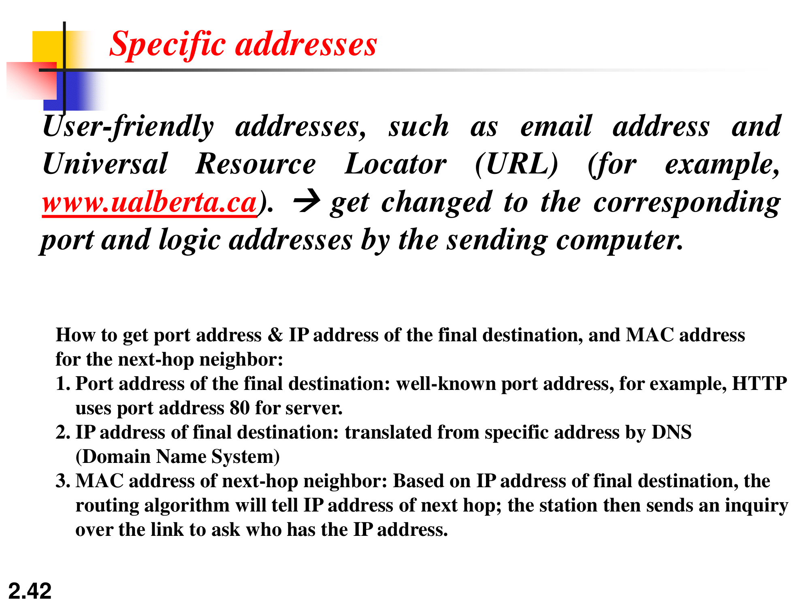
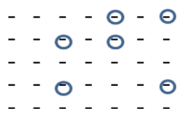
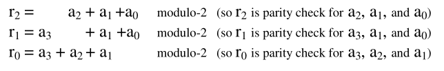
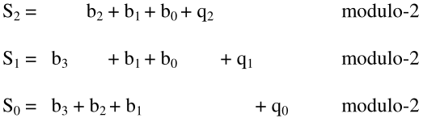
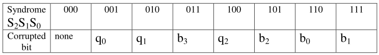

# OSI Model

1) Physical layer
    - Reliable process-to process message delivery
    - Interface to transmission medium
    - Responsible for movements of individual bits from one hop (node) to the
      next
    - Physical connections
    - Data rate
    - Bit synchronization (achieved with preamble)
    - Neighbourhoods
2) Data link layer
    - Error detection and retransmission
    - Responsible for carrying data frames between adjacent nodes
    - Makes layer 1 appear error free to upper layers
    - Neighbourhoods
    - LAN
    - MAC (Physical addressing)
        - changes from hop-to-hop
3) Network layer
    - Route determination
    - handles packets
    - communication from sender to far away receiver
    - multiple hops
    - IP addressing
        - does not change hop-to-hop
    - Computer-to-computer
4) Transport layer
    - Error detection and retransmission
    - process to process communication (sender to receiver)
    - TCP
    - port addressing
        - does not change hop-to-hop
5) Session layer
    - Login and logout procedure
6) Presentation layer
    - Format and code conversion serrvices
    - translation, compression, encryption, decription
7) Application layer
    - Provides access to the end user
    - user interface

# Network topologies

- Mesh
  - number of ports:
  n)

  - number of links:
  n%7D%7B2%7D)

- Bus

- Ring

- Star

# Definitions

## Full duplex vs. Half Duplex
- ethernet and WiFi is half duplex
- phone calls are full duplex


## Circuit switching vs. Packet Switching
- Circuit Switching 
- resources are reserved
- Packet Switching

|                            | Circuit Switching | Packet Switching |
|----------------------------|-------------------|------------------|
| Dedicated path             | ✅                | ❌               |
| Bandwidth available        | fixed             | dynamic          |
| Potential waste            | ✅                | ❌               |
| Store and forward          | ❌                | ✅               |
| Call setup                 | ✅                | ❌               |
| Congestion                 | at setup time     | on every packet  |
| Charge                     | per minute        | per packet       |
| Same route for all packets | ✅                | ❌               |

## LAN vs. WAN
- LAN is for short distance
- WAN can be simple or complex
    - telephone internet
    - the entire internet

## Specific addresses


## Hamming distance
- for a minimum hamming distance , up to  errors can be detected.
- up to t errors can be detected, 

## Block coding
- data word
```
101|
010|
~~~
```
- code word (the entire thing including the parity)
```
101|0
010|1
~~~
111 1
```

An example where a 2d parity check canot detect a 6 bit error



This is a type of linear block code

## Hamming Code
Given the parity check bits:



The syndrome is calculated:





## Cyclic code
- also a type a linear block code
- each code is a cyclic bit shift of another code
- also, because it's a linear block code, every nonzero codeword is generated by
  XOR-ing 2 other codewords

## Checksum
- add everything up, and at the end add a negative term to make the sum 0

