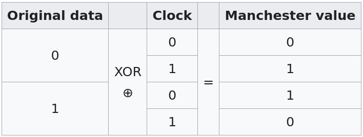

# OSI Model

1) Physical layer
    - Reliable process-to process message delivery
    - Interface to transmission medium
    - Responsible for movements of individual bits from one hop (node) to the
      next
    - Physical connections
    - Data rate
    - Bit synchronization (achieved with preamble)
    - Neighbourhoods
2) Data link layer
    - Error detection and retransmission
    - Responsible for carrying data frames between adjacent nodes
    - Makes layer 1 appear error free to upper layers
    - Neighbourhoods
    - LAN
    - MAC (Physical addressing)
        - changes from hop-to-hop
3) Network layer
    - Route determination
    - handles packets
    - communication from sender to far away receiver
    - multiple hops
    - IP addressing
        - does not change hop-to-hop
    - Computer-to-computer
4) Transport layer
    - Error detection and retransmission
    - process to process communication (sender to receiver)
    - TCP
    - port addressing
        - does not change hop-to-hop
5) Session layer
    - Login and logout procedure
6) Presentation layer
    - Format and code conversion serrvices
    - translation, compression, encryption, decription
7) Application layer
    - Provides access to the end user
    - user interface

# Network topologies

- Mesh
  - number of ports:
  n)

  - number of links:
  n%7D%7B2%7D)

- Bus

- Ring

- Star

# Definitions

## Full duplex vs. Half Duplex
- ethernet and WiFi is half duplex
- phone calls are full duplex


## Circuit switching vs. Packet Switching
- Circuit Switching 
- resources are reserved
- Packet Switching

|                            | Circuit Switching | Packet Switching |
|----------------------------|:-----------------:|:----------------:|
| Dedicated path             | ✅                | ❌               |
| Bandwidth available        | fixed             | dynamic          |
| Potential waste            | ✅                | ❌               |
| Store and forward          | ❌                | ✅               |
| Call setup                 | ✅                | ❌               |
| Congestion                 | at setup time     | on every packet  |
| Charge                     | per minute        | per packet       |
| Same route for all packets | ✅                | ❌               |

## LAN vs. WAN
- LAN is for short distance
- WAN can be simple or complex
    - telephone internet
    - the entire internet

## Specific addresses


## Hamming distance
- for a minimum hamming distance , up to  errors can be detected.
- up to t errors can be detected, 

## Block coding
- data word
```
101|
010|
~~~
```
- code word (the entire thing including the parity)
```
101|0
010|1
~~~
111 1
```

An example where a 2d parity check canot detect a 6 bit error


This is a type of linear block code

## Hamming Code
Given the parity check bits:


The syndrome is calculated:


## Cyclic code (CRC)
- also a type a linear block code
- each code is a cyclic bit shift of another code
- also, because it's a linear block code, every nonzero codeword is generated by
  XOR-ing 2 other codewords
```
         codeword
         ___________
divisor |dataword000
         ...
         ..
         .
        _____________
        syndrome bits
```

```
   Sending                                 Receiving

     1111                                 1111
     -------                              ------
1011|1101000                         1011|1101001
     1011|||                              1011
     ----v||                               ---
      1100||                               1100
      1011||                               1011
      ____v|                                ---
       1110|                                1110
       1011|                                1011
       ----v                                 ---
        1010                                 1011
        1011                                 1011
        ----                                  ---
         001                                  000

So, the dataword sent is 1101001
```

Received is accepted if syndrome bits are 000

## Checksum
- add everything up, and at the end add a negative term to make the sum 0

## Manchester Code


## Bit Stuffing
 - is the process of adding an extra 0 when there are 5 consecutive 1s in the
    data

## Byte Stuffing
- adding 1 extra byte whenever there is a flag or escape character in the text

## HDLC


## ALOHA


- To make the transfer collision free, find the average frame transmission time
(bits/speed).
- the vulnerable time is 2 times average frame transmission
- so no station sould send later than one transmission time before the transmission, and no station should start sending during the one transmission time framw when the station is sending

The throughput is 
- The maximum is S = 0.184 when G=0.5
- G is the average number of frames generated by the system during one frame transmission time
- S is the average number of successful frames during one frame transmission time

### Slotted ALOHA


The throughput is 
- The maximum is S = 0.368 when G=1

## CSMA/CD
- each station listens before transmission
- reduces collision but does not avoid because of propagation time
- retransmit on collision
- ethernet
- transmission time is 2 * propagation time
- minimum frame size is bandwidth/speed * frame transmssion time

## CSMA/CA
- see assignment 6

### Hidden station problem
- 2 devices may be connected to a router, but be physically too far away to
detect each other's signals, and therefore unable to detect collision

## MAC
```
format is XX:XX:XX:XX:XX:XX (6 bytes)
```
- the least significant bit of the first byte
    - 0 unicast
    - 1 multicast
- broadcast: all bits are 1 i.e. FF:FF:FF:FF:FF:FF

## QoS (Quality of Service)
- FIFO queue
- Leaky bucket
- Priority queue
- Weighted fair queuing
    - there are 3 queues, each with different weight
    - a switch picks 3 packets from te first queue, 2 from the second...


## IP Addresses
- Binary converter
    https://www.browserling.com/tools/ip-to-bin

### Given a mask /15, and knowing one host is 24.32.12.56
- To find the first and last address, write it in binary.
- The first address is the (32-15=17) rightmost bits turned to 0
- and then the last one is those bits turned to 1
- https://www.calculator.net/ip-subnet-calculator.html?cclass=any&csubnet=15&cip=24.32.12.56&ctype=ipv4&printit=0&x=57&y=12
```
24.32.12.56 /15
00011000.00100000.00001100.00111000

First address
00011000.00100000.00000000.00000000
                ~.~~~~~~~~.~~~~~~~~
24.32.0.0

Last address
00011000.00100001.11111111.11111111
                ~.~~~~~~~~.~~~~~~~~
24.33.255.255
```

### Assigning an address block 16.0.0.0/8 with equal size subnets

- the total number of addresses is 
- so, the number of addresses for each subnet is 
- so, the subnet mask is 32-14=18
    - i.e. the first (leftmost) 18 bits are the mask
    - 255.255.192.0
- the mask for the entire block is 8, so the first 8 bits of all addresses will
  all start like 16.XXX.XXX.XXX, since we take the first 8 bits of 16.0.0.0
- so, the other 10 bits (18-8=10) determine the 1024 subnets
    - the first subnet
      ```
      16.00000000.00000000.0
      ##.~~~~~~~~.~~
      starts with 16.0.0.0

      16.00000000.00111111.255
      ends with 
      16.0.63.255
      ```
    - the last subnet
      ```
      16.11111111.11000000.0
      ##.~~~~~~~~.~~
      starts with 16.255.192.0


      16.11111111.11111111.255
      ends with 16.255.255.255
      ```
### IPv6 shorten/expand
  https://www.ultratools.com/tools/ipv6Compress

  https://www.ultratools.com/tools/ipv6Expand

### IPv4 header
| Field                | Never change | May change | Always change |
|----------------------|:------------:|:----------:|:-------------:|
| VER                  |       ✅     |            |               |
| Total length         |              |      ✅    |               |
| Identification       |       ✅     |            |               |
| Flags                |              |      ✅    |               |
| Fragmentation Offset |              |      ✅    |               |
| Time to live (TTL)   |              |            |       ✅      |
| Protocol             |       ✅     |            |               |
| Header checksum      |              |            |       ✅      |
| Source IP address    |       ✅     |            |               |
| Destination IP addr  |       ✅     |            |               |


- Given HLEN, the total number of bytes in the header is HLEN * 4
- Offset is measured in units of bytes


## Fragmentation
- if M is 0 then there are no more fragments (it is the last)
- if M is 1 it may be a middle or first
    - decide based on fragmentation offset
    - if offset is 0 then it's the first frame
    - if not, it's a middle frame

- when a fragment is split
  - get total length - header size (hlen * 4) (ex: 620 - (5*4) = 600)
  - divide by x fragments (600/3 = 200)
  - add the header size back to the fragment for total length of new packet (220)
  - offset of the first one is the same as teh original packet
  - offset of the second will be previous offset + 200 / 8

## UDP
- length = IP length - IP header length

## TCP
Guarantees no out of order segments are delivered to the process

- sequence number
  - first one is a random number between 0 and 2^32 -1
  - the next frame's sequence number contains the position of the first byte in
  that frame 
  - the ACK number contains the next byte expected to be received
- SYN does not carry data but it consumes a sequence number
- SYN + ACK does not carry data but consumes one sequence number
- ACK does not consume sequence number IF no data is being carried
- FIN consumes one sequence number if it does not carry data
- FIN + ACK consumes one sequence number if it does not carry data

### Congestion

- slow start
    - size of window increases exponentially until a threshold
- congestion avoidance
    - size of congestion window increases additavely until congestion is detected


